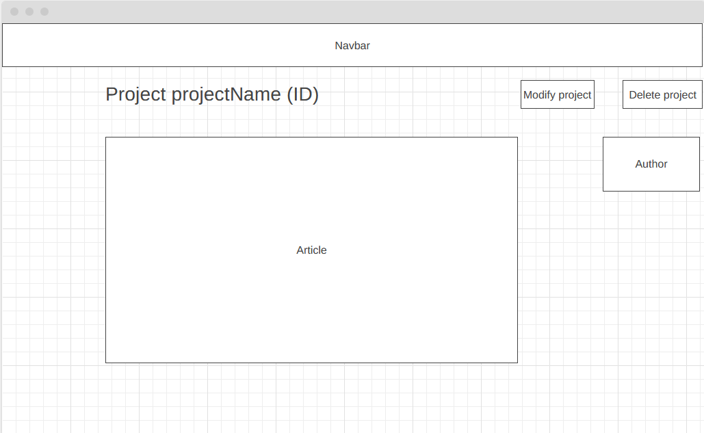
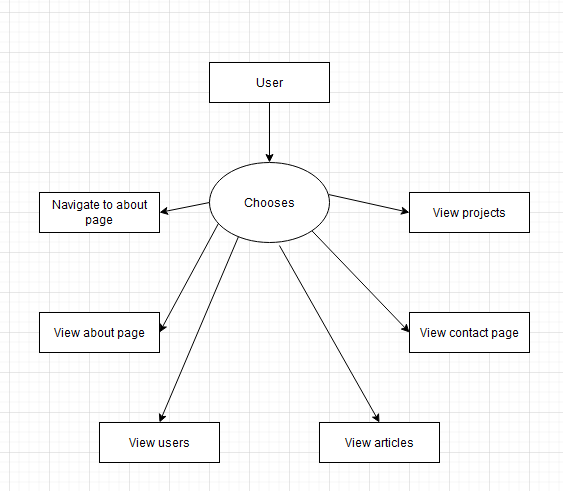

# Rest API specification

## Class diagram

# Wireframes
## Index/Main page

The index page, the javascript effect ended up being a typing effect.
Top right is for navigation, and the logo takes the user back to this main page.
The article explains a bit about myself.
  

## About

This is a simple about me page, the top part is the same navigation as the main page.
The about me part is only text.
  

## Contact

This is a simple contact page, where the user can find places to contact me.
These places for contact are hyperlinks that can be clicked taking the user
directly to my profile.
  

## Projects

This page has a list of all projects present in the database, loaded using javascript.
The user can click on a button to add or remove a project, these buttons take
the user to a different page where these actions can be performed
  

## Add project

This page allows the user to input data for a new project. The + buttons next to
both the language and skill input is there to add an extra input field, to allow
for more skills to be added. When one of these boxes is clicked and an extra field is there
a - button is created, when this - button is pressed, the extra field will disappear.
When the user presses the add project button, the project gets added if the input is valid,
finally the user is forwarded to the projects page.
  

## Specific project

This page allows the user to delete a project. The dropdown menu is filled
with the names of all projects present. When the user presses on delete,
the selected project will be deleted from the database
and then the user is forwarded to the projects page.

# Use case diagrams
### Index/Main page

### About page

### Contact page

### Projects & project-details page

### Add project page

# Sequence diagrams
The basic function of the system:

Project page:

Adding a project:

Removing a project:

Projects specification page:
