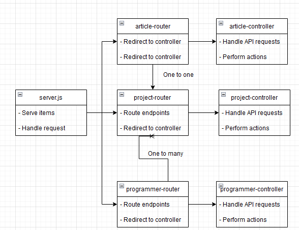
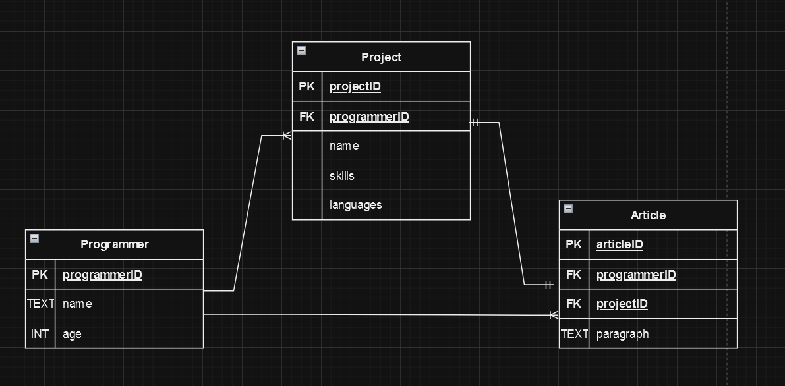

# How to run
To run the program, navigate to the "node" folder in command prompt, then run npm start.
The website can then be visited at [localhost:3000](http://localhost:3000).
Just clicking the index file after starting the server does not work as it should.

# Class diagram

# Database schema

# Changelog
Stopped loading the navbar with js since this is probably a reason why I didn't get points for semantic html  
Remade diagrams in draw.io  
Made css more responsive with media queries  
Split documentation into 2 files, a technical and functional design document  
Added new entities to the database: Programmers (First Name, Age) & Article (TEXT about a project)  
Made and added database schema to technical design  
No longer using AJAX in front end  
Fixed add-project page, project controller & router to work with new db schema  
Added global error handling  
Added router for new entities  
Added SOC for database, so now controllers don't directly access the database but use a helper module  
Add controller & database helper for the new entities  
Fixed the add-project page, so it works without node serving the page  
Added properly working PUT request for project, article and programmer  
Made a new page with the Programmer and Article when a project is clicked  
Made it so user can make a new programmer and article from the new project page.  
Cleaned up code, made all "let" variables that can be "const" variables into "const" variables  
Made ' into " wherever possible for consistency.  
Added functionality to delete a project from the project specific page.  
Allow the user to modify a project from the specification page  
Tried to make the modify screen look pretty, but failed  
